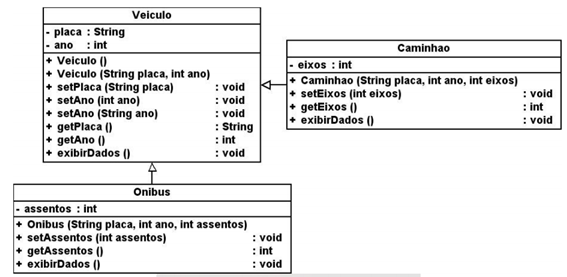

# C214-Lab

Referente ao laboratório da disciplina de Engenharia de Software do Instituto Nacional de Telecomunicações - INATEL.
Aqui estarão os códigos feitos durantes o semestre para as aulas e trabalhos da matéria.

 

<h1 align="center">Laboratório de Engenharia de Software</h1>

 

<h2>Menu de Navegação</h2>

- <a href="#intro">Introdução</a>
- <a href="#tecnologia">Tecnologias</a>
- <a href="#exerc">Exercícios</a>
  - <a href="#a1">Aula 2 - Revisão POO</a>
  - <a href="#a2">Aula 3 - Gerenciamento de dependências</a>
  - <a href="#a3">Aula 4 - Git e Github</a>
  - <a href="#a4">Aula 5 - README</a>
  - <a href="#a5">Aula 6 - API básica</a>
  - <a href="#a6">Aula 7 - Teste Unitário</a>
  - <a href="#a7">Aulas 8 e 9 - API com CRUD completo e testes Mock</a>
  - <a href="#a8">Aula 10 - GitHub Actions</a>
  - <a href="#a9">Aula 11 - Design Patterns</a>
  - <a href="#a10">Aulas 12 e 13 - React</a>
- <a href="#footer">Rodapé</a>

 
<h2 id="tecnologia" align="left">Tecnologias 🚀</h2>

  
  
  
  
  

 

<h2 id="exerc" align="left">Exercícios 📚</h2>

    <h3 id="a1">Aula 2 - Revisão POO 🔎</h3>
      <a>Implementar o código necessário para criar o diagrama abaixo:   </a>
      
    <h3 id="a2">Aula 3 - Gerenciamento de dependências ⚙️</h3>
      Elaborar uma <a href="https://github.com/jvoliveirag/C214-Lab/tree/main/Aula3_Ger_Dependencias">calculadora</a> em que sejam realizadas diversas operações e que valide os tipos de variáveis.
    <h3 id="a3">Aula 4 - Git e Github 🔗</h3>
      <a>Criar um repositório no GitHub com os códigos realizados para os exercícios entregues nas aulas.</a>
    <h3 id="a4">Aula 5 - README 📝</h3>
      <a>Criar um README elaborado para o repositório criado na aula anterior.</a>
    <h3 id="a5">Aula 6 - API básica 📄</h3>
      Criar, no mínimo, 2 <a href="https://github.com/jvoliveirag/C214-Lab/tree/main/Aula6_API">APIs</a> REST de um CRUD básico de filme. Deve conter, ao menos, 4 parâmetros, como por exemplo: nome, produtora, atores (protagonista), ano. Deve haver validação dos dados.
    <h3 id="a6">Aula 7 - Teste 🧪</h3>
      Criar, no mínimo, 6 <a href="https://github.com/jvoliveirag/C214-Lab/tree/main/Aula6_API/test">casos de teste</a> unitários utilizando o framework Jest.
    <h3 id="a7">Aulas 8 e 9 - API com CRUD completo e testes Mock 🔬</h3>
      Com os conhecimentos adquiridos sobre criação de APIs REST, construção de CRUD, testes unitários, testes mock e GIT, criar todas as funções básicas de um CRUD de CARRO e realizar todos os testes necessários (unitários e mock). Para conferir o projeto clique <a href="https://github.com/jvoliveirag/API-C214-LAB">aqui</a>.
    <h3 id="a8">Aula 10 - GitHub Actions ⚠️</h3>
      Utilizando o exercício realizado nas aulas 8 e 9, realize a Integração Contínua/Entrega Contínua (CI/CD) com GitHub Actions, conforme ensinado em aula, no <a href="https://github.com/jvoliveirag/API-C214-LAB">repositório</a> garantindo o funcionamento correto desse recurso.
    <h3 id="a9">Aula 11 - Design Patterns 🏁</h3>
      Criar uma classe/função convencional e uma factory que façam a mesma coisa. Clique <a href="https://github.com/jvoliveirag/C214-Lab/tree/main/Aula11_Design_Pattern">aqui</a> para conferir.
    <h3 id="a10">Aulas 12 e 13 - React ⚛️</h3>
      Criar duas pages: uma para listar todos os carros e uma para listar os carros por placa.

 

